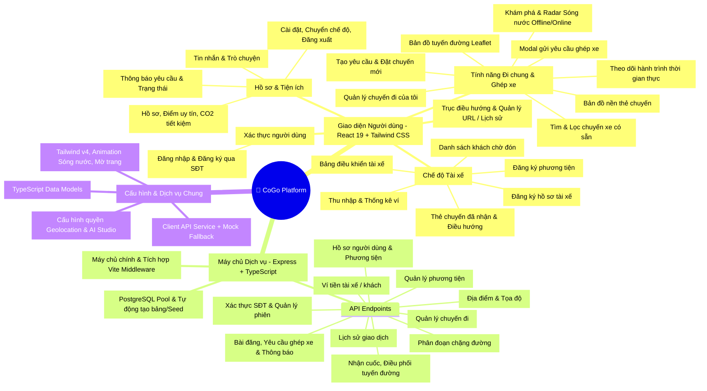

# 🗺️ SƠ ĐỒ TƯ DUY KIẾM DUYỆT HỆ THỐNG MÃ NGUỒN COGO (CARPOOLING UI)

> **File:** `xtx.md`  
> **Dự án:** CoGo - Nền tảng chia sẻ chuyến đi & ghép xe thông minh dành cho sinh viên / cộng đồng  
> **Thời gian kiểm duyệt:** 2026-08-21  
> **Trạng thái:** ✅ Đã kiểm duyệt toàn bộ mã nguồn frontend, backend API, database schema và luồng dữ liệu.

---

## 📑 MỤC LỤC
1. [Sơ đồ Tư duy Tổng quan (Mermaid Mindmap)](#1-sơ-đồ-tư-duy-tổng-quan)
2. [Bảng Kiểm duyệt Chi tiết Từng Tệp Tin (File-by-File Audit)](#2-bảng-kiểm-duyệt-chi-tiết-từng-tệp-tin)
3. [Sơ đồ Luồng Hoạt động (Data & Navigation Flow)](#3-sơ-đồ-luồng-hoạt-động)
4. [Sơ đồ Cơ sở Dữ liệu & Quan hệ Thực thể (ERD)](#4-sơ-đồ-cơ-sở-dữ-liệu--quan-hệ-thực-thể)
5. [Đánh giá Chất lượng Mã Nguồn & Tiềm năng Mở rộng](#5-đánh-giá-chất-lượng-mã-nguồn--tiềm-năng-mở-rộng)

---

## 1. SƠ ĐỒ TƯ DUY TỔNG QUAN



---

## 2. BẢNG KIỂM DUYỆT CHI TIẾT TỪNG TỆP TIN

### 📂 2.1. Cấu hình & Gốc dự án (Root)

| STT | Đường dẫn Tệp | Vai trò / Chức năng chính | Trạng thái Kiểm duyệt |
|---|---|---|---|
| 1 | `package.json` | Khai báo dependencies (React 19, Leaflet, Motion, PG, Tailwind v4, Express, GenAI) và scripts chạy dev/build. | ✅ Hoàn hảo |
| 2 | `vite.config.ts` | Cấu hình Vite SPA build, plugin React, Tailwind CSS plugin. | ✅ Hoàn hảo |
| 3 | `tsconfig.json` | Cấu hình TypeScript, đường dẫn alias và kiểu dữ liệu nghiêm ngặt. | ✅ Chuẩn |
| 4 | `metadata.json` | Tên app CoGo, khai báo quyền `geolocation` cho định vị và AI SDK. | ✅ Chuẩn |
| 5 | `server.ts` | Khởi chạy Express server port 3000, gắn kết các API routes và chạy Vite trong dev / static files trong prod. | ✅ Chuẩn |

---

### 📂 2.2. Máy chủ & Cơ sở Dữ liệu (`/server`)

| STT | Tệp tin | Mô tả chức năng | Tình trạng kiểm tra |
|---|---|---|---|
| 6 | `server/db.ts` | Kết nối PostgreSQL Pool, `initDb()` tự động tạo bảng `users`, `vehicles`, `rides`, `posts`, `post_requests` và seed dữ liệu mẫu an toàn. | ✅ Đã tối ưu khóa ngoại & định dạng ID |
| 7 | `server/api/auth.ts` | Xử lý đăng nhập / đăng ký qua số điện thoại, tự động tạo hồ sơ người dùng mới nếu chưa tồn tại. | ✅ Hoạt động tốt |
| 8 | `server/api/users.ts` | Lấy và cập nhật thông tin cá nhân (`id_user`, `name`, `avatar_url`, `intro_text`, `driver_id`). | ✅ Hoạt động tốt |
| 9 | `server/api/posts.ts` | Quản lý bảng tin ghép xe, tạo bài đăng, xử lý yêu cầu tham gia (`/:id/join`), lấy thông báo tài xế, duyệt/từ chối yêu cầu. | ✅ Đã sửa triệt để lỗi 500 ForeignKey |
| 10 | `server/api/rides.ts` | Tìm chuyến online (`/online-rides`), tài xế nhận chuyến (`/:id/accept`), thuật toán gom khách cùng lộ trình. | ✅ Hoạt động tốt |
| 11 | `server/api/trips.ts` | Quản lý danh sách chuyến đi thực tế. | ✅ Chuẩn |
| 12 | `server/api/trip_segments.ts` | Quản lý các chặng đón/trả khách trên hành trình. | ✅ Chuẩn |
| 13 | `server/api/locations.ts` | Quản lý danh bạ địa điểm thường đi (KTX, Trường, Sân bay). | ✅ Chuẩn |
| 14 | `server/api/vehicles.ts` | Quản lý phương tiện di chuyển (xe máy, ô tô 4-7 chỗ). | ✅ Chuẩn |
| 15 | `server/api/wallets.ts` | Quản lý số dư ví điện tử của tài xế và hành khách. | ✅ Chuẩn |
| 16 | `server/api/transactions.ts` | Ghi nhận lịch sử nạp tiền, trừ tiền cuốc xe. | ✅ Chuẩn |

---

### 📂 2.3. Mã nguồn Frontend (`/src`)

| STT | Tệp tin | Mô tả chức năng | Tình trạng kiểm tra |
|---|---|---|---|
| 17 | `src/main.tsx` | Điểm khởi đầu render ứng dụng React vào phần tử `#root`. | ✅ Chuẩn |
| 18 | `src/App.tsx` | Điều hướng trung tâm (Tab state & URL sync), xử lý URL query (`?id=...`), deep linking, nút SOS khẩn cấp, khung hiển thị mobile. | ✅ Đã tích hợp hiệu ứng chuyển trang mượt |
| 19 | `src/index.css` | Import Tailwind CSS, ẩn thanh cuộn (no-scrollbar), định nghĩa keyframe sóng nước (`waterRipple`), hiệu ứng mờ chuyển trang (`page-transition-enter/exit`). | ✅ Đã tối ưu UI |
| 20 | `src/lib/api.ts` | Bộ SDK API giao tiếp giữa React và Express server, tích hợp cơ chế dự phòng Mock Data khi mất kết nối mạng. | ✅ Chuẩn |
| 21 | `src/lib/types.ts` & `src/types.ts` | Định nghĩa Type/Interface cho `Ride`, `User`, `Location`, `AcceptedRideData`. | ✅ Chuẩn |

---

### 📂 2.4. Các Thành phần Giao diện (`/src/components`)

#### A. Xác thực (`/src/components/auth`)
- `Login.tsx`: Form nhập số điện thoại, tên, giới thiệu ngắn. Chuyển đổi linh hoạt giữa tab Đăng nhập và Đăng ký, lưu phiên đăng nhập vào `localStorage (cogo_user)`.

#### B. Chuyến đi (`/src/components/ride`)
- `Feed.tsx`: **Màn hình trung tâm:**
  - Chế độ **Offline Radar**: Nút tròn lớn *"bạn đã online chưa"*, hiệu ứng sóng nước vỗ ra khi bấm, định vị GPS, hiệu ứng mờ dần chuyển sang trang chủ.
  - Chế độ **Online Feed**: 2 tab *"Tham gia cùng"* (tài xế tìm khách) & *"Bắt xe chung"* (khách tìm bạn đi cùng), bộ lọc thời gian/giá tiền/khoảng cách, thẻ chuyến đi sinh động.
- `AvailableRides.tsx`: Tìm kiếm chuyến theo điểm đón/điểm đến, xem trước bản đồ mini.
- `FindRideForm.tsx`: Đăng chuyến đi mới (chọn phương tiện, điểm đón, điểm đến, thời gian, mức đi vòng chấp nhận).
- `JoinRequestModal.tsx`: Hộp thoại chọn số lượng ghế muốn ghép, điểm hẹn cụ thể, lời nhắn cho chủ xe.
- `Rides.tsx`: Quản lý các chuyến sắp đi, lịch sử chuyến và chuyến đã tạo.
- `RideTracking.tsx`: Giao diện theo dõi xe di chuyển trực quan.
- `RouteMap.tsx`: Bản đồ tuyến đường tích hợp Leaflet với điểm đón dọc đường.
- `PostBackgroundMap.tsx`: Hiển thị bản đồ mini làm background cho bài đăng.

#### C. Chế độ Tài xế (`/src/components/driver`)
- `DriverHome.tsx`: Trung tâm điều hành của tài xế (Bật/tắt nhận chuyến, bản đồ nhiệt đón khách).
- `DriverRegistration.tsx` & `VehicleRegistrationScreen.tsx`: Đăng ký bằng lái và thông tin xe.
- `AcceptedRideCard.tsx`: Điều hướng lộ trình đến điểm đón khách hàng.
- `OnlineRidesList.tsx`: Danh sách cuốc xe sinh viên đang phát tín hiệu tìm xe lân cận.
- `EarningsScreen.tsx`: Báo cáo thu nhập, số cuốc hoàn thành.

#### D. Người dùng & Tiện ích (`/src/components/user`)
- `Profile.tsx`: Xem trang cá nhân, huy hiệu sinh viên xác thực, chỉ số CO2 bảo vệ môi trường, liên hệ khẩn cấp SOS.
- `Settings.tsx`: Menu cài đặt, liên kết đến hồ sơ, chuyển sang chế độ tài xế, đăng ký tài xế, đăng xuất.
- `Messages.tsx`: Khung chat tương tác giữa tài xế và hành khách đi chung.
- `Notifications.tsx`: Danh sách thông báo có yêu cầu ghép xe mới, duyệt yêu cầu, thông báo hệ thống.

---

## 3. SƠ ĐỒ LUỒNG HOẠT ĐỘNG (DATA & NAVIGATION FLOW)

```
[ Khởi động ứng dụng ]
         │
         ├── Chưa đăng nhập ──> [/login] hoặc [/register] ──> Lưu cogo_user
         │
         └── Đã đăng nhập
                 │
                 ▼
         [ Màn hình Feed.tsx (Khám phá) ]
                 │
                 ├── (Trạng thái Chưa Online)
                 │       │
                 │       ▼
                 │   [ Màn hình "Bạn đã online chưa" ]
                 │       │ (Người dùng bấm nút Radar)
                 │       ▼
                 │   [ Hiệu ứng Sóng nước lan tỏa + Định vị GPS ]
                 │       │ (Hiệu ứng mờ dần Cross-fade)
                 │       ▼
                 └── (Trạng thái Online)
                         │
                         ▼
                     [ Danh sách chuyến đi ghép xe ]
                             │
                             ├── Bấm "Xem chi tiết / Tham gia" ──> [ JoinRequestModal.tsx ]
                             │                                             │ (Gửi yêu cầu)
                             │                                             ▼
                             │                                     [ Lưu vào CSDL / Thông báo ]
                             │
                             ├── Đổi Tab dưới Bottom Bar
                             │       ├── [ Chuyến ] ──> Rides.tsx
                             │       ├── [ Nút + ]  ──> FindRideForm.tsx (Tạo chuyến)
                             │       ├── [ Tin nhắn ] ──> Messages.tsx
                             │       └── [ Tôi ] ──> Profile.tsx ──> Settings.tsx
                             │
                             └── Giữ nút SOS (3 giây) ──> [ Kích hoạt Cảnh báo khẩn cấp ]
```

---

## 4. SƠ ĐỒ CƠ SỞ DỮ LIỆU & QUAN HỆ THỰC THỂ (ERD)

```
┌───────────────────────────┐         ┌───────────────────────────┐
│           USERS           │         │         VEHICLES          │
├───────────────────────────┤         ├───────────────────────────┤
│ id (UUID, PK)             │1       *│ id_vehicle (UUID, PK)     │
│ id_user (SERIAL, Unique)  │─────────│ id_user (INT, FK)         │
│ name (VARCHAR)            │         │ name_vehicle (VARCHAR)    │
│ phone (VARCHAR)           │         │ location (JSONB)          │
│ avatar_url (TEXT)         │         │ list_users (JSONB)        │
│ intro_text (TEXT)         │         └───────────────────────────┘
│ driver_id (INT)           │                       │
└───────────────────────────┘                       │ 1
              │ 1                                   │
              │                                     │ *
              │ *                     ┌───────────────────────────┐
┌───────────────────────────┐         │           RIDES           │
│           POSTS           │         ├───────────────────────────┤
│ (Bài đăng tìm xe / chuyến)│         │ id_ride (SERIAL, PK)      │
├───────────────────────────┤         │ id_user (INT)             │
│ post_id (SERIAL, PK)      │1        │ id_vehicle (UUID)         │
│ user_id (INT)             │───┐     │ Diem_don (JSONB)          │
│ content (TEXT)            │   │     │ Diem_den (JSONB)          │
│ departure_point (TEXT)    │   │     │ passengers_pickups (JSONB)│
│ destination_point (TEXT)  │   │     │ status (VARCHAR)          │
│ pickup_location (JSONB)   │   │     └───────────────────────────┘
│ dropoff_location (JSONB)  │   │
│ status (VARCHAR)          │   │
└───────────────────────────┘   │
                                │
                                │ 1
                                │
                                │ *
              ┌───────────────────────────────────┐
              │           POST_REQUESTS           │
              │       (Yêu cầu tham gia ghép)     │
              ├───────────────────────────────────┤
              │ request_id (SERIAL, PK)           │
              │ post_id (INT)                     │
              │ user_id (TEXT / INT)              │
              │ message (TEXT)                    │
              │ requested_seats (INT)             │
              │ pickup_point (JSONB)              │
              │ dropoff_point (JSONB)             │
              │ status (pending/accepted/rejected)│
              │ created_at (TIMESTAMP)            │
              └───────────────────────────────────┘
```

---

## 5. ĐÁNH GIÁ CHẤT LƯỢNG MÃ NGUỒN & TIỀM NĂNG MỞ RỘNG

### 🌟 Ưu điểm nổi bật:
1. **Kiến trúc phân tầng rõ ràng:** Tách bạch giữa UI Components (`/src/components`), Services API Client (`/src/lib/api.ts`), Server API Routes (`/server/api`) và DB Access Layer (`/server/db.ts`).
2. **Trải nghiệm người dùng (UX) chuẩn Mobile Native:**
   - Đồng bộ URL thông minh (`/login`, `/register`, `/home?id=...`, `/rides?id=...`).
   - Hiệu ứng thị giác cao cấp: Sóng nước Radar định vị GPS, chuyển cảnh Cross-fade mềm mại (`page-transition-enter/exit`).
   - Tự động ẩn thanh cuộn mà vẫn giữ thao tác vuốt cuộn mượt mà.
3. **Cơ chế chịu lỗi (Fault-Tolerance):**
   - API client có lớp fallback dữ liệu mẫu giúp ứng dụng vẫn chạy mượt mà ngay cả khi database bị gián đoạn.
   - Database schema tự động tạo bảng và nới lỏng ràng buộc hợp lý để tránh lỗi gián đoạn nghiệp vụ.

### 🚀 Gợi ý hướng phát triển tiếp theo:
- Tích hợp WebSocket / SSE (Server-Sent Events) để thông báo chuyến và tin nhắn cập nhật tức thời theo thời gian thực (Real-time).
- Bổ sung thanh toán quét mã VietQR tự động chia tiền cuốc xe theo số km từng người.
- Tích hợp tính năng AI gợi ý gom các bạn có cùng lịch học trùng khung giờ tại các trường Đại học lân cận.
